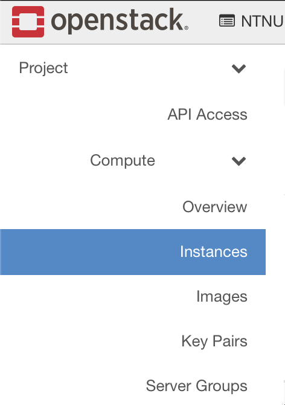
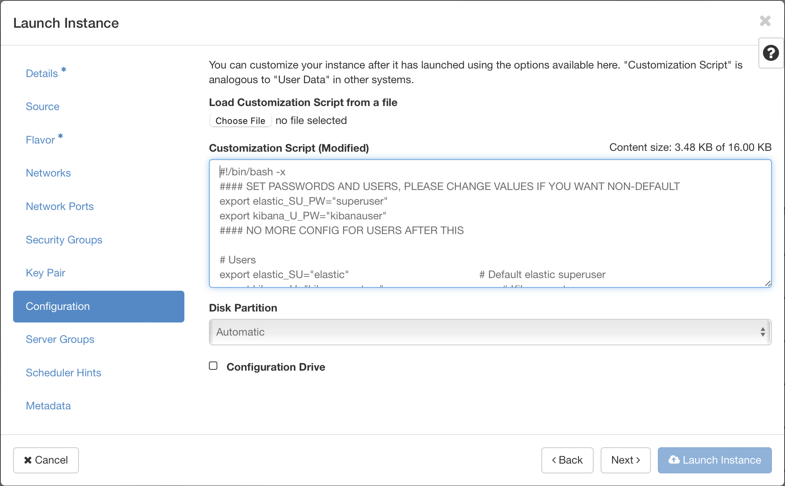

# elkStack for bookface
THIS IS NOT FOR USE IN A PRODUCTION ENVIRONMENT!
This is meant to be used in the backend created in DCSG2003 - robuste og skalerbare tjenester at NTNU Gjøvik

# Installation
Installation of this is fairly straightforward:

1. Locate the install.sh script and keep it ready so you can copy the contents. [Here's a link!](https://raw.githubusercontent.com/BenRedic-FyFazan/elkStack_DCSG2003/main/install.sh)

2. Go to your project in openstack, and then select Compute -> Instances on the left hand side.

3. Fill in the required fields as follows:
     - Instance Name: pick one!
     - Source: Ubuntu Server 22.04 LTS (Jammy Jellyfish) amd64
     - Flavor: gx3.4c4r (remind me to change this when i'm more certain of resource reqs)
     - Key Pair: Your managers SSH key
     - Configuration: SEE NEXT STEP!

4. Remember that install.sh script i asked you to keep ready? Copy all of it and paste it into the 'Customization Script' box like so:

On the top of the script you can change the passwords for the elastic superuser and the kibana_system user. 
For now i recommend keeping them at the default value (IE not 100% sure on the results if you change it).

5. Launch instance!

6. Wait 15 minutes or so. Grab a coffee and some water(remember to hydrate!), hug a friend and appreciate this moment of automation.
If you're not sure it's done, you can check the system log through skyhigh: 
click on the instance name -> Log -> View Full Log (right side corner)

7. Assign a floating IP to the VM (like you did on the manager)

8. Head on over to https://[YOUR FLOATING IP]:5601 
    - Notice: remember the 's' in https, we use SSL/TLS for the traffic.

9. DANGER! DANGER! DANGER! ... No not really.
We use a self-signed certificate to enable the SSL/TLS traffic i mentioned.
In other words, the certificates won't be signed by an authority your browser recognizes. 
Fear not though, we created them ourselves so just accept the risk and move on! ... =)

10. You can now log into the dashboard with the user 'elastic' and the password set in the install.sh (default: superuser). Hooray!

