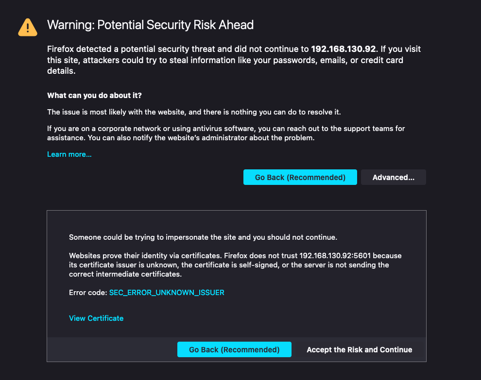
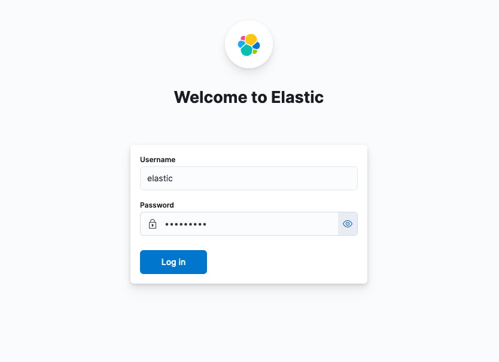

# elkStack for bookface
THIS IS NOT FOR USE IN A PRODUCTION ENVIRONMENT!
This is meant to be used in the backend created in DCSG2003 - robuste og skalerbare tjenester at NTNU Gjøvik

# Installation
Installation of this is fairly straightforward:

1. Pull this repository to your manager, preferably to your HOME directory.You can use the following commands:
```bash
cd $HOME
git clone https://github.com/BenRedic-FyFazan/elasticStack.git
```

2. Run the install_elastic_stack.sh from the elkStack folder within the repo:
```bash
$HOME/elasticStack/elkStack/install_elastic_stack.sh
```
 
3. Wait 15 minutes or so. Grab a coffee and some water(remember to hydrate!), hug a friend and appreciate this moment of automation.
The script will let you know when the process is finished.

4. Assign a floating IP to the VM (like you did on the manager)

5. Head on over to https://[YOUR FLOATING IP]:5601 
    - Notice: remember the 's' in https, we use SSL/TLS for the traffic.

6. DANGER! DANGER! DANGER! ... No not really.
We use a self-signed certificate to enable the SSL/TLS traffic i mentioned.
In other words, the certificates won't be signed by an authority your browser recognizes. 
Fear not though, we created them ourselves so just accept the risk and move on! ... =)


7. You can now log into the dashboard with the user 'elastic' and the password set in the install.sh (default: superuser). Hooray!

